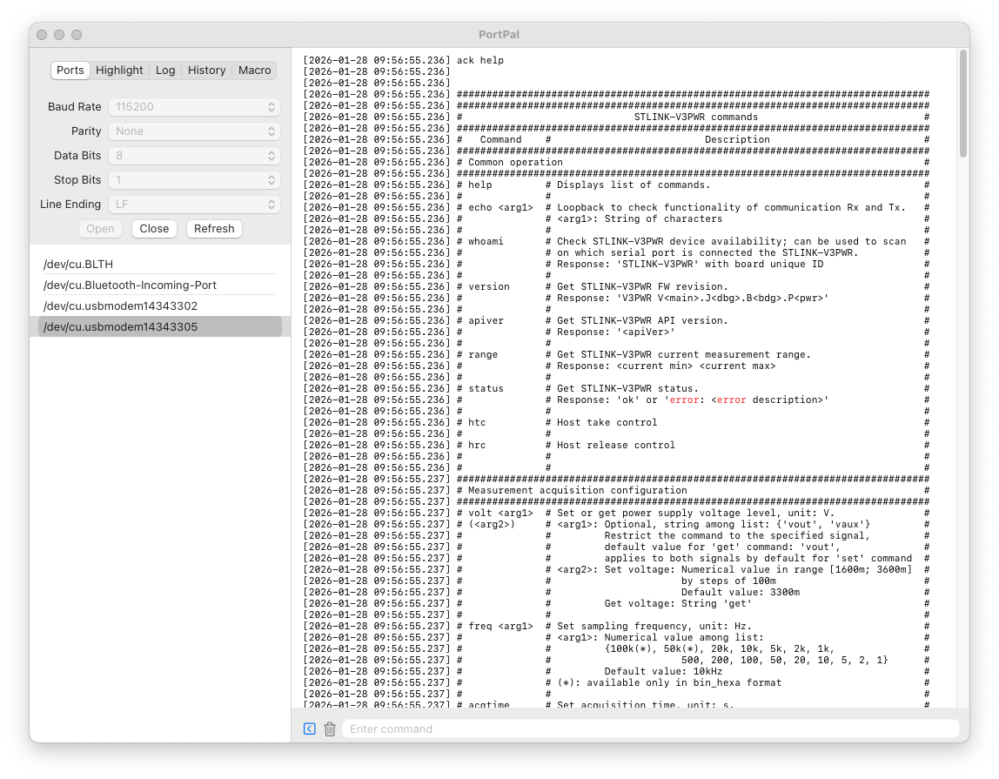

# PortPal

PortPal is a useful Serial Port Terminal application designed specifically for macOS. It is a useful tool for development, offering a seamless experience for engineers working with serial communication.

## Key Features

### Port
- **Configurable Line Ending**: Support for customized line endings (CR, LF).

### Highlight
- **Custom Color**: specific colors can be assigned to keywords.
- **Notification**: Notifications available for detected keywords.

### Log
- **Smart Logging**: View logs with precise timestamps, control auto-scrolling, and save logs to files.

### History
- **Count Input History**: Tracks usage frequency for each command.
- **Management**: Delete individual history items.
- **Sorting**: Sort by latest usage or frequency count.

### Macro
- **Loop Count**: Set repetition counts for macro execution.
- **Configurable Delay**: Set precise delays between commands.
- **Enable/Disable**: Toggle specific macro features on or off.

### v1.3.0 To-Do
- [x] write app introduction in README.md
- Ymodem: new feature
    - [ ] send
    - [ ] receive
- Usability Improvements
    - [ ] macro description
    - [ ] erase all history button
    - [ ] command input bar icon description
    - [ ] Check Notification Permission (Open System Settings if disabled)
  
## Screenshots

<!--  -->

## Changelog
For previous version history, please refer to [CHANGELOG.md](CHANGELOG.md).
